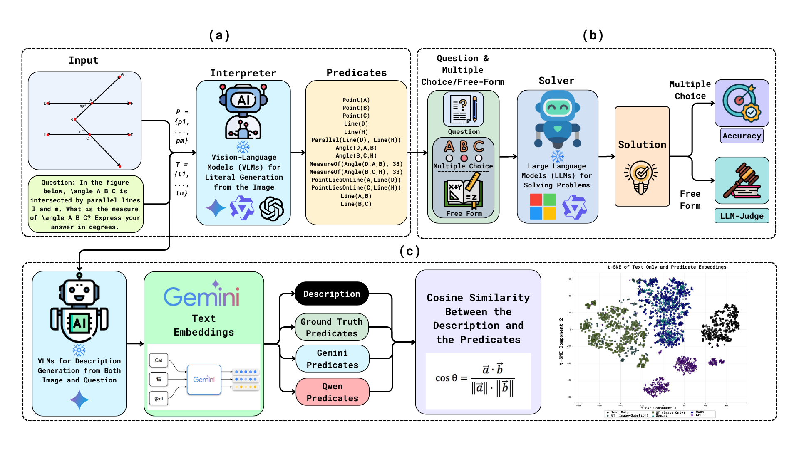

# Interpreter-Solver

## A Two-Agent Framework for Geometric Reasoning with Large Vision and Language Models

<!-- > 📄 [Anonymous ACL Submission](https://anonymous.4open.science/r/Interpreter-Solver/) -->

## 📌 Overview

We present **Interpreter-Solver**, a two-stage pipeline for visual mathematical reasoning:
- The **Interpreter Agent** parses images and questions to generate formal logical predicates.
- The **Solver Agent** uses these predicates with the question to compute the final answer.

## 🧪 Datasets Overview

| Dataset       | Total Problems | MCQ | Free-Form | Source |
|---------------|----------------|-----|-----------|--------|
| Geometry3K    | 3,001          | ✅  | ❌        | [Lu et al. (2021)](https://aclanthology.org/2021.acl-long.528.pdf) |
| MathVerse     | 2,612          | ✅  | ✅        | [Zhang et al. (2025)](https://arxiv.org/pdf/2403.14624)            |

## 📁 Folder Structure

```
.
├── Geo3K Evaluation/
│   ├── Ground Truth Predicates/
│   ├── Interpreter-Solver (VLMs)/
│   ├── Solver/
│   ├── Interpreter (Gemini)/
│   ├── Interpreter (GPT-4o mini)/
│   ├── Interpreter (Qwen 2.5 VL-32B)/
│   ├── Interpreter (Qwen 2.5 VL-7B)/
│   ├── Other Approaches/
│   ├── Predicates/
│   └── Single Agent Evaluation/

├── MathVerse Evaluation/
│   ├── Interpreter (Gemini)/
│   ├── Interpreter-Solver (VLMs)/
│   ├── Predicates/
│   └── Single Agent Evaluation/

├── Notebooks/
│   ├── Geometry 3K/
│   ├── MathVerse/
│   └── Predicates Generation/

└── README.md
```

## ✨ Key Features

- 📐 **Two-Stage Agent System**: Decouples perception (VLM) from reasoning (LLM)
- 🎯 **Zero-Shot Performance**: No fine-tuning required
- 🔍 **Predicate-Based Reasoning**: Symbolic formalization of visual geometry
- 🧠 **High Accuracy**: Outperforms prior state-of-the-art on both benchmarks

## 🧠 Methodology



*(a) An Interpreter Agent generates formal predicates from images and questions using VLMs.(b) A Solver Agent then solves the problem using these predicates as LLM input.(c) The 2D t-SNE plot visualizes the semantic similarity of generated descriptions and predicate embeddings, indicating the Interpreter's comprehension of predicate generation.*

## 🧰 Getting Started

### ✅ Requirements
- `Python 3.10+`
- `transformers`, `torch`, `pillow`, `openai`, `google-generativeai`, `scikit-learn`, `tqdm`, etc.

### 🔧 Installation

```bash
git clone https://github.com/faiyazabdullah/Interpreter-Solver.git
cd interpreter-solver
```

### 🧪 Running Evaluations

```bash
# Generate predicates (e.g., with Gemini)
cd Notebooks/Predicates\ Generation/
jupyter notebook gemini_predicates.ipynb

# Run Interpreter-Solver evaluation
cd ../Geometry\ 3K/
jupyter notebook interpreter_solver_qwen8b.ipynb
```

## 🧪 Results

| Dataset       | Model                                      | #Params      | Accuracy |
|---------------|---------------------------------------------|--------------|----------|
| **Geometry3K**| Inter-GPS                                   | 406M         | 57.5%    |
|               | GeoDRL                                      | 44M          | 68.4%    |
|               | AutoGPS                                     | ≈200B        | 81.6%    |
|               | Interpreter-Solver-Phi-4 (Ours)            | 14B-4bit     | 70.05%   |
|               | Interpreter-Solver-Qwen-3 (Ours)           | 8B-4bit      | 79.53%   |
|               | Interpreter-Solver-Gemini-2.0 Flash (Ours) | ≈40B         | **83.19%**   |
| **MathVerse** | G-LLaVa                                     | 13B          | 16.6%    |
|               | MathVerse                                   | 7B           | 25.9%    |
|               | OpenVLThinker                               | 7B           | 47.9%    |
|               | Interpreter-Solver-Qwen-3 (Ours)           | 8B-4bit      | **69.67%**   |

<!--
## 🧩 Citation

```bibtex
@inproceedings{interpreter-solver-2025,
  title = {Seeing and Solving: An Interpreter-Solver Framework for Geometric Reasoning with Large Vision and Language Models},
  author = {Anonymous},
  booktitle = {ACL 2025},
  year = {2025}
}
```

---

---

## 📬 Contact

For issues, open a GitHub issue. For collaboration, email: **your.email@domain.com**

---
-->
