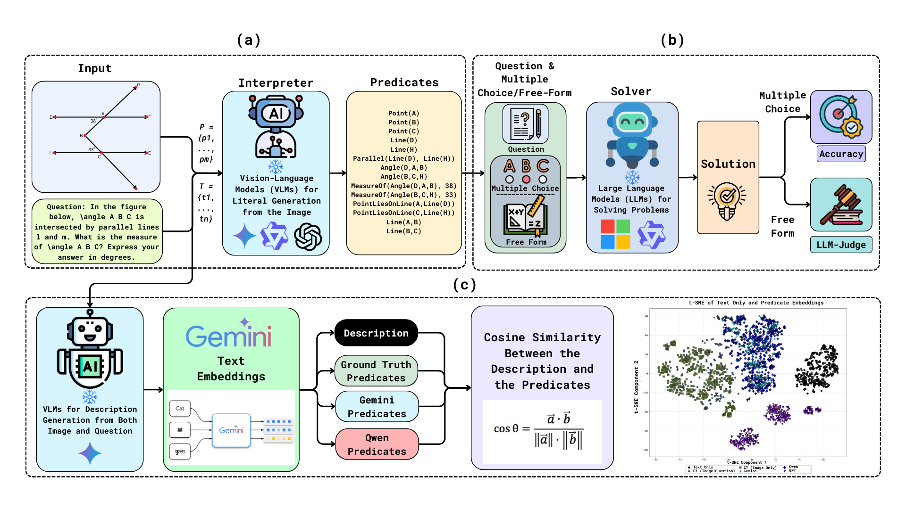

# _Do Multi-Agents Solve Better Than Single?_ Evaluating Agentic Frameworks for Diagram-Grounded Geometry Problem Solving and Reasoning

_Abstract: Diagram-grounded geometry problem solving is a critical benchmark for multimodal large language models (MLLMs), yet the benefits of multi-agent design over single-agent remain unclear. We systematically compare single-agent and multi-agent pipelines on four visual math benchmarks: Geometry3K, MathVerse, OlympiadBench, and We-Math. For open-source models, multi-agent consistently improves performance. For example, Qwen-2.5-VL (7B) gains +6.8 points and Qwen-2.5-VL (32B) gains +3.3 on Geometry3K, and both Qwen-2.5-VL variants see further gains on OlympiadBench and We-Math. In contrast, the closed-source Gemini-2.0-Flash generally performs better in single-agent mode on classic benchmarks, while multi-agent yields only modest improvements on the newer We-Math dataset. These findings show that multi-agent pipelines provide clear benefits for open-source models and can assist strong proprietary systems on newer, less familiar benchmarks, but agentic decomposition is not universally optimal._

<!-- > 📄 [Anonymous ACL Submission](https://anonymous.4open.science/r/Interpreter-Solver/) -->

## 📌 Overview

We present **Interpreter-Solver**, a two-stage, multi-agent pipeline for visual mathematical reasoning, together with a **single-agent** baseline built from the same models. We systematically compare these paradigms across four visual math benchmarks.

- The **Interpreter Agent** parses images and questions to generate compact formal logical predicates.
- The **Solver Agent** uses these predicates (plus the original question) to compute the final answer.
- In the **single-agent** setting, a VLM directly answers from the diagram and text without explicit predicates.

Our results show that multi-agent decomposition **consistently helps open-source models**, especially at medium scale and on newer benchmarks, while **strong proprietary systems** often remain stronger in single-agent mode, with multi-agent offering only **modest gains** on newer visual math datasets.

## 🧪 Datasets Overview

We evaluate on four benchmarks spanning school geometry, mixed-format visual math, and Olympiad-level problems:

| Dataset        | Total Problems | MCQ | Free-Form | Notes                                         | Source |
|----------------|----------------|-----|-----------|-----------------------------------------------|--------|
| Geometry3K     | 3,001          | ✅  | ❌        | HS-level diagram-grounded geometry            | https://aclanthology.org/2021.acl-long.528.pdf |
| MathVerse      | 2,612          | ✅  | ✅        | Visual math with multiple text–diagram views  | https://arxiv.org/pdf/2403.14624 |
| OlympiadBench  | 8,476          | ✅  | ✅        | Olympiad-level math/physics, bilingual        | https://arxiv.org/abs/2402.14008 |
| We-Math        | 6,500          | ✅  | ✅        | Visual math with hierarchical concepts        | https://arxiv.org/abs/2409.14411 |

## 📁 Folder Structure

```
.
├── Geo3K Evaluation/
│   ├── Ground Truth Predicates/
│   ├── Interpreter-Solver (VLMs)/
│   ├── Solver/
│   ├── Interpreter (Gemini)/
│   ├── Interpreter (GPT-4o mini)/
│   ├── Interpreter (Qwen 2.5 VL-32B)/
│   ├── Interpreter (Qwen 2.5 VL-7B)/
│   ├── Other Approaches/
│   ├── Predicates/
│   └── Single Agent Evaluation/

├── MathVerse Evaluation/
│   ├── Interpreter (Gemini)/
│   ├── Interpreter-Solver (VLMs)/
│   ├── Predicates/
│   └── Single Agent Evaluation/

├── Notebooks/
│   ├── Geometry 3K/
│   ├── MathVerse/
│   └── Predicates Generation/

└── README.md
```

## 🧠 Methodology



*(a) An Interpreter Agent generates formal predicates from images and questions using VLMs. (b) A Solver Agent then solves the problem using these predicates as LLM input. (c) The 2D t-SNE plot visualizes the semantic similarity of generated descriptions and predicate embeddings, indicating the Interpreter's comprehension of predicate generation.*

### ✅ Requirements

- `Python 3.10+`
- Core libraries:
  - `transformers`
  - `torch`
  - `pillow`
  - `openai`
  - `google-generativeai`
  - `scikit-learn`
  - `tqdm`
  - plus standard utilities (e.g., `numpy`, `pandas`)

Install dependencies (example):

```bash
pip install -r requirements.txt
```

### 🔧 Installation

```bash
git clone https://github.com/faiyazabdullah/Interpreter-Solver.git
cd Interpreter-Solver
```

### 🔑 API Keys

You will need API keys for:
- **Gemini** (Interpreter and/or Solver)
- Optional: **OpenAI** or other providers if you want to swap models

Set them as environment variables, e.g.:

```bash
export GEMINI_API_KEY="YOUR_KEY"
export OPENAI_API_KEY="YOUR_KEY"
```

### 🧪 Running Evaluations

```bash
# Generate predicates (e.g., with Gemini)
cd Notebooks/Predicates\ Generation/
jupyter notebook gemini_predicates.ipynb

# Run Interpreter-Solver evaluation
cd ../Geometry\ 3K/
jupyter notebook interpreter_solver_qwen8b.ipynb
```
## 📊 Results

Multi-Agent vs Single-Agent (Four-Benchmark Summary)

| Dataset       | Solver               | #Params      | Multi-Agent                                   | Single-Agent                            |
|--------------|----------------------|-------------:|-----------------------------------------------|-----------------------------------------|
| Geometry3K   | Qwen-2.5-VL          | 7B           | 60.07% (+6.8)                                 | 53.24%                                  |
|    | Qwen-2.5-VL          | 32B          | 72.05% (+3.3)                                 | 68.72%                                  |
|    | Gemini-2.0-Flash     | ≈40B         | 83.86% (−1.3)                                 | **85.19%**                              |
| MathVerse    | Qwen-2.5-VL          | 7B           | 53.67 / 36.93 / 46.19% (−6.0 overall)        | **58.94 / 43.75 / 52.16%**             |
|     | Qwen-2.5-VL          | 32B          | **78.44 / 54.55 / 67.77%** (+1.1 overall)    | 76.38 / 54.55 / 66.67%                 |
|     | Gemini-2.0-Flash     | ≈40B         | 84.81 / **63.48** / 74.68% (−0.45 overall)   | **86.01** / 61.65 / **75.13%**         |
| OlympiadBench| Qwen-2.5-VL          | 7B           | **61.84%** (+9.4)                             | 52.44%                                  |
| | Qwen-2.5-VL          | 32B          | **64.56%** (+6.67)                            | 57.89%                                  |
| | Gemini-2.0-Flash     | ≈40B         | 71.31% (−2.46)                                | **73.77%**                              |
| We-Math      | Qwen-2.5-VL          | 7B           | **45.79%** (+2.66)                            | 43.13%                                  |
|       | Qwen-2.5-VL          | 32B          | **59.01%** (+4.64)                            | 54.37%                                  |
|       | Gemini-2.0-Flash     | ≈40B         | **62.90%** (+1.74)                            | 61.16%                                  |

*For MathVerse, cells are reported as “MC / Free-Form / Overall” accuracy.*


## Comparison with Prior Work

We also compare our **Interpreter–Solver** pipeline against existing methods:

| Dataset       | Model                                      | #Params      | Accuracy |
|---------------|---------------------------------------------|--------------|----------|
| **Geometry3K**| Inter-GPS                                   | 406M         | 57.5%    |
|               | GeoDRL                                      | 44M          | 68.4%    |
|               | AutoGPS                                     | ≈200B        | 81.6%    |
|               | Interpreter-Solver-Phi-4 (Ours)            | 14B-4bit     | 70.05%   |
|               | Interpreter-Solver-Qwen-3 (Ours)           | 8B-4bit      | 79.53%   |
|               | Interpreter-Solver-Gemini-2.0 Flash (Ours) | ≈40B         | **83.19%**   |
| **MathVerse** | G-LLaVa                                     | 13B          | 16.6%    |
|               | MathVerse                                   | 7B           | 25.9%    |
|               | OpenVLThinker                               | 7B           | 47.9%    |
|               | Interpreter-Solver-Qwen-3 (Ours)           | 8B-4bit      | **69.67%**   |

<!--
## 🧩 Citation

```bibtex
@inproceedings{interpreter-solver-2025,
  title = {Seeing and Solving: An Interpreter-Solver Framework for Geometric Reasoning with Large Vision and Language Models},
  author = {Anonymous},
  booktitle = {ACL 2025},
  year = {2025}
}
```
-->

## 📬 Contact

For issues, open a GitHub issue. For collaboration, email: **msayeedi212049@bscse.uiu.ac.bd**
